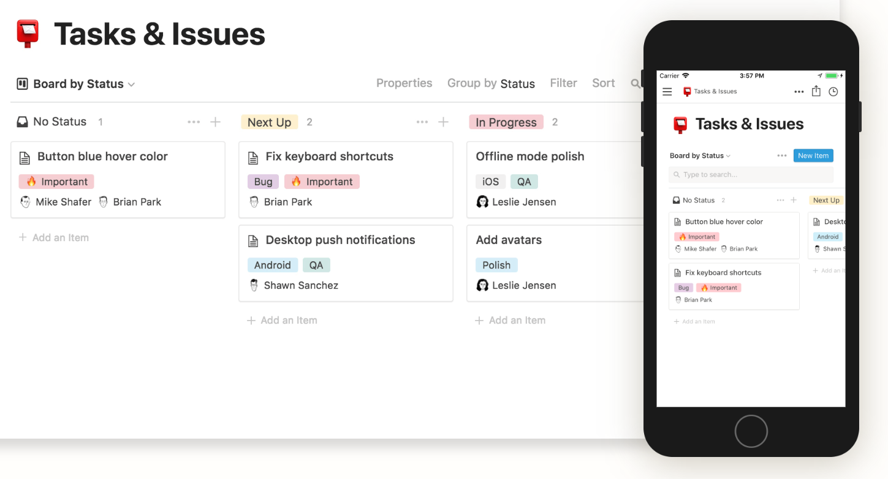

### Notion 사용해보며

현재 나는 일하거나 공부를 진행할 때 notepad++와 trello를 주로 사용하고 있다. 그런데 notepad에 진행하는 code들과 내가 메모하는 것들이 섞이면서 정리가 안되는게 느끼다가 다른 툴을 찾아야겠다는 생각이 들었다. Evernote도 내 기준에서는 만족스럽지 않아서 다른 것을 찾아보다가 우연치 않게 Notion이라는 걸 발견했다.

[출처: Notion 홈페이지]

처음에는 아 notepad나 evernote 대용으로 사용할 수 있나? 정도로 살폈는데, 그 정도 범위보다 더 컸다... 구현된 기능으로만 보니 trello, google sheets 등과 같은 기능을 전부 Notion이라는 앱 하나로만 다 사용할 수 있게 되있더라. trello나 evernote 등을 import하여 사용할 수 있게도 해두었는데, 아마 Notion으로 이동하기 편하게 함이나 여러 이유로 인해 가능하게 해둔 것 같다.

 Notion UI는 마음에 들어서 조금씩 한번 써보고 있다. 아직 사용한 지도 얼마 되지 않았고 많은 기능을 사용해본 건 아니지만 그래도 좀 더 사용하면서 어떤 장단점이 있는지 더 알 수 있을 것 같다. 아직은 Notion만의 장점은 뭐다! 하는 건 못 느꼈다ㅠㅠ 아직은 Notion이랑 trello를 같이 이용할 것 같다.

이렇게 얘기했는데...   
조금만 사용해보니 바로 편한 점을 찾았다;;;   
난 주로 trello 이용해서 내 공부 목록이나 할 일 list를 정리하는 편인데, 불편했던 점 하나가 할 일을 적으면서 밑에 comment가 보이도록 달고 싶었다. 근데 trello에서는 그렇게 설정하기는 어려웠는데 notion에서는 가능하더라.
(이건 사용자 따라 좋을 수도 있고, 별로일 수도 있을 것 같다.)
